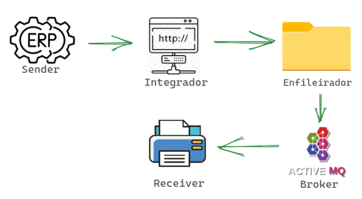

# Configurações do ambiente de desenvolvimento do Projeto
- O projeto foi desenvolvido usando a ferramenta de build Maven 3.6.3
- A versão do JDK (Java Development Kit) utilizado foi a 1.8 (Java 8).
- Foi utilizado o Apache ActiveMQ versão 5.16.4 como message broker.

# Diretórios
Por padrão, os diretórios de entrada, processados e saída estão configurados para a pasta: `src/main/resources/`.
Estes diretórios podem ser trocado no arquivo application.properties e as pastas serão geradas automaticamente
assim que iniciada a aplicação na classe EscalarApplication.

# Autenticação
A autenticação é feita através do endpoint exposto pelo AutenticacaoController,
no qual depois de disparada o método POST para o endereço http://localhost:8080/auth o
Bearer Key será gerado e impresso na saída do console da aplicação.

# Resumo do Projeto Escalar
Avaliação Prática do Alpinista Willian Teles Pinto para o Projeto Escalar da empresa Oobj Tecnologia da Informação.

O projeto desenvolvido consiste de uma solução de integração nos moldes das soluções conhecidas no mercado.
Há 5 componentes principais: Sender, Integrador, Enfileirador, Broker e Receiver.
Cada componente é descrito abaixo:

● A aplicação Sender, que pode ser um ERP ou um PDV e, para este projeto, foi utilizada
a ferramenta Postman para simular as chamadas aos endpoints da API de integração.

● O Integrador HTTP (IntegradorController) foi um dos componentes desenvolvidos no projeto
e é o responsável por expor os endpoints de integração e iniciar o fluxo apresentado 
acima que é executado automaticamente em resposta à “chegada” de uma requisição.

● O Enfileirador tem como papel ler os arquivos da pasta de entrada
e enfileirar os dados no Message Broker.

● O Broker, aqui desempenhado pelo Apache ActiveMQ, irá distribuir as mensagens
para as múltiplas instâncias consumidoras da aplicação Receiver.

● O Receiver irá consumir as mensagens do Broker e, neste momento, apenas
simula através de saída no console a impressão dos manifestos de transporte.

A execução do fluxo apresentado acima ocorre de forma automática em
resposta ao evento de “chegada” de uma requisição no Integrador HTTP.

## Caso de Teste
Abaixo segue a amostra dos dados de entrada (enviados para o Integrador HTTP)
e amostra dos dados de saída esperados (gerados pelo Receiver no final do fluxo).

[Amostra dos dados de entrada](https://github.com/WillianTelesOobj/escalar/blob/main/Amostra%20dos%20dados%20de%20entrada.txt)

[Amostra dos dados de saída](https://github.com/WillianTelesOobj/escalar/blob/main/Amostra%20dos%20dados%20de%20sa%C3%ADda.txt)